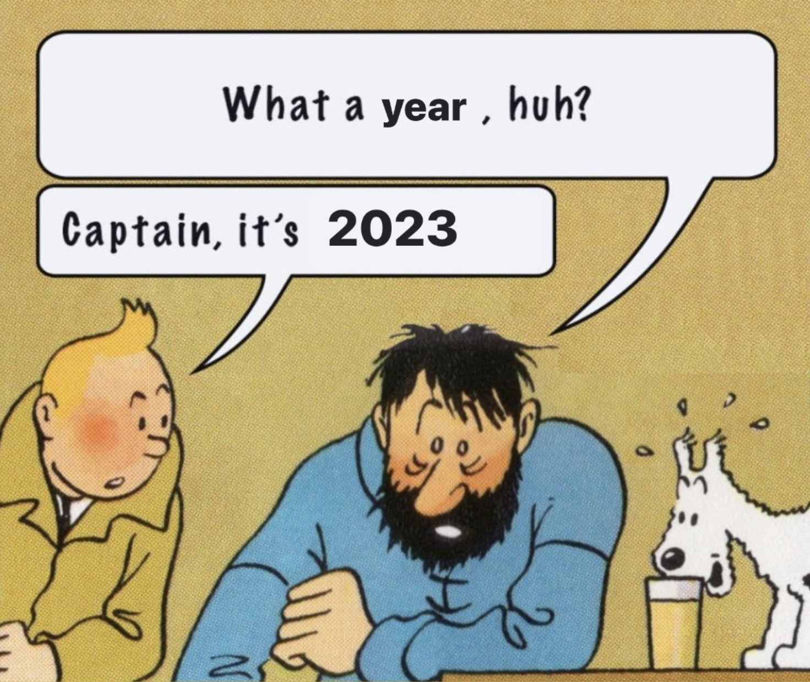

> Procrastinated writing this till the last day of the year, but as they say, all is well that ends well. 

>2022 has been a rollercoaster of a year that went on going up professionally and down personally, but such is life. You win some, you lose some. 

>2022 recap here goes nothing

## 🏆 Good things that happened in 2022

### ⚠️🚨 This list has a lot of survivorship bias. Tread with caution!

**1. Graduated with a Mechatronics (robotics) engineering degree from Manipal.**
_Feels good to have an engineering degree in a field that is a bit niche. However, I practically don’t remember most of it, thanks to an online college_

**2. Started a full-time product management job at Razorpay as an APM.**
_I joined Razorpay full-time on 3rd Jan 2021(the first working day of 2021), and it has been an insanely fulfilling year at work._

_The amount of learning I have had on PMing and how scaled startups operate is insane, and I am so grateful I decided to go down this route._

_In my second year, I used to tell a friend that there was no way I could get here because they just don’t hire APMs off-campus. From there to today, quite a journey_
    
**3. Got promoted to PM - 1 in my first review cycle.**
    
_I was fortunate enough to pick up projects, which, combined with a kickass team and outstanding mentorship, resulted in a high impact across the board._ 
_A promotion is an outcome but seeing your efforts get recognized gratifying._
    
** 4. Moved to Bangalore and started living all by myself.**
    
_This is probably up there and more significant than achievements at work, but living alone in a new city was a considerable achievement._
_It taught me a lot of things (mom, if you are reading this, yes, I miss home, and yes, it’s hard to live alone 🙄)_
    
** 5. Really understood money management, taxes, and personal finance.**
    
_One of the upsides of building a payroll and taxation product in India is that you can recite most taxation laws in your sleep at 2:30 am._ 
_This year I learned about harnessing the power of credit cards(sorry, dad, that one extra card is needed for miles), investing, and spending money._
_I made my share of splurges (that Call of Duty for 5k is worth it, ok) but did reasonably well overall._
    
 **6. Hit 10k followers on Twitter.**
    
_It was not something I optimized for, but the milestone did feel good, and it became a big dopamine rush when I was in the late 9 thousand._

## 📈 Things that I need to do better in 2023
    
**1. Improving my health and fitness**

_The past year my health has taken a massive toll. I had a neck brace for a month and was on heavy medications for another because of shoulder pain. This needs to change for good._
        
**2. Read more and read better.**
        
_Much of the content I consume today combines Twitter and Substack. I don’t have a content routine or cadence that I stick to._
_Books are rare and often left in half. I need to bring this to an order._

**3. Travel more**
        
_Go to Vietnam. In all seriousness, I need to go on at least one solo trip, either to the mountains or the beaches in India, this year_
        
_Want to watch the cricket world cup final live this year too. Since it is happening in India, hopefully, the Indian team makes it._
        
**4. Get out of my house and explore Bangalore**
        
_If you know me personally, you would know how much I HATE getting out of the house. It is a running joke in my entire friend circle. I would like to try to change this and be a bit more social outside the online world._

Shoutout to everyone who has been a part of 2022, you know who you are.

To a better, healthier and prosperous 2023 🥂
