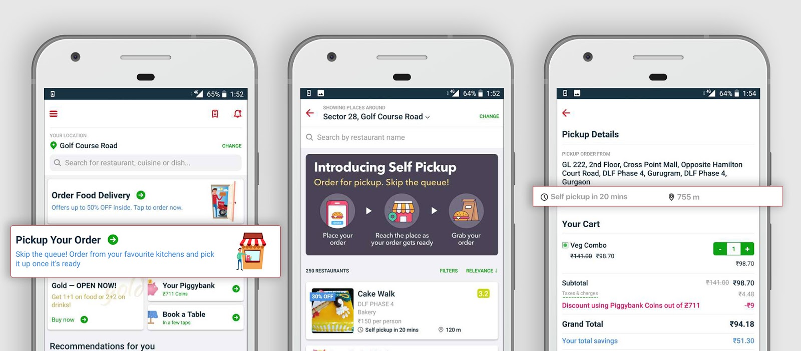

> This is a **fictional** prd that I wrote as part of my assignment for a PM internship at Bounce.
> All metrics are guesstimates.
> This was written based of a template that can be found [here](https://manassaloi.com/2020/01/23/product-spec-twitter-messages.html)

> This is my first attempt at writing a PRD so please feel free to dm me any suggestions/feedback on [Twitter](https://twitter.com/manan_0308)

# Self Pickup from Restaurants
This spec discusses about **(WHY)**, **(WHAT)**, **(WHEN)** needs to be built for initiating self pickup from restaurants. It does not discuss the technical implementation **(HOW)** for it.

Author:Manan Agarwal, Fictional PM of Swiggy

Last updated: November 10th, 2020

### Problem Statement:
Swiggy is evaluating if it should start pickup from restaurants as a new feature on it’s app.

You are the PM on the project, what do you do next?

* Please list down assumptions you have made

* How would you plan to launch the project?

* How will you evaluate success/failure of the launch

## Why should we build it?

* Competition parity

* Engagement/Retention metrics	

* OKRs (Vision: build better urban lifestyle)

* After the pandemic people are apprehensive of using delivery partners because of their multiple interaction with various elements in the system.

## Problem it solves

1. Wait in restaurant queues to place your order
2. Wait additionally for the order to be made
3. High delivery costs incurred during peak hours when ordering from near your home
4. Swiggy’s end reduces burn wrt rider costs

## Assumptions 
* Growth in gross volume of orders.

* Increase in the retention, DAU and corresponding lagging metrics eg: less time spend for in app ordering

* Major UX changes, on the customer side. (different swiggy pickup, like in blr airport)

* Consumers willing to trade picking orders to save time. 

## Main User Stories

*   As an office goer, I may pickup snacks/coffee/lunch/dinner based on time I go to office, thus reducing my total time elapsed to order and get food.
*   As a home-Maker, I’ll be able to bring food home on a regular basis for the family, since I do it almost everyday. 
*   As a college student, I don’t want to spend money on delivery charges and with a packed schedule I cannot wait for my order to get ready
*   As a restaurant owner, self ordering kiosks are very expensive and due to Covid I wouldn’t want multiple people using the same kiosk and hence your phone becomes a kiosk.

# Defining the goal of the feature:

Offering unparalleled convenience to urban consumers by eliminating the last mile time and introducing self pickup from restaurants allowing consumers to have maximum flexibility with respect to their order. 

Framework Used: DHM (Delight, Hard to Copy, Margin Enhancement)

## Potential metrics to  watch out for / impact 

*   Orders done daily
    *   For Bangalore, approximately 60% of all orders in a day form category 1, 10-15%  form category 2, additional 15% would form category 3 of people using our app \

*   Orders within distance
    *   Understanding from data how many orders have been placed within 1-2km radius of the consumer. A fair estimate would be that ~10% of all orders would fall in the under 1.5km range and ~25% would be under 500meters from restaurants.

## Success metrics

*  On restaurant end:
      
      *  Additional GMV generated by pick up(5-10% additional) 
      
  	  *  Completed Order per week in pickup mode (>24) 
	    
      *  Percentage of orders declined both normally + in peak hour (&lt;5%+&lt;2%) 
      
      *  Waiting Minutes (&lt;2mins) 
	    
      *  Decline in total # of delivery through delivery partners

*  On Consumer end:

		 
    
     *  Average basket size(>Rs 380) 
		
     *  Increase in DAU (7%)
     
     *  Weekly orders (>2)

# Product Requirements (The What) 

<table>
  <tr>
   <td>Requirement
   </td>
   <td>Priority
   </td>
  </tr>
  <tr>
   <td>Homepage to have a specific button which lists “Pickup your order”
   </td>
   <td>MUST HAVE
   </td>
  </tr>
  <tr>
   <td>Select the restaurant you wish to pick up your food from
   </td>
   <td>MUST HAVE
   </td>
  </tr>
  <tr>
   <td>Show the menu
   </td>
   <td>MUST HAVE
   </td>
  </tr>
  <tr>
   <td>Place the order, adding a cart feature
   </td>
   <td>MUST HAVE
   </td>
  </tr>
  <tr>
   <td>Create payment flow
   </td>
   <td>MUST HAVE
   </td>
  </tr>
  <tr>
   <td>Provided with an ETA
   </td>
   <td>MUST HAVE
   </td>
  </tr>
  <tr>
   <td>Alert user via email about order being placed
   </td>
   <td>MUST HAVE
   </td>
  </tr>
  <tr>
   <td>Alert via push notif, order is placed and ETA screen should pop up
   </td>
   <td>MUST HAVE
   </td>
  </tr>
  <tr>
   <td>Alert via push notif, when food is ready to be picked up
   </td>
   <td>MUST HAVE
   </td>
  </tr>
  <tr>
   <td>Alert via push notif, when order is delivered and give prompt for feedback in terms of 1-5 rating overall experience with a comment box.
   </td>
   <td>MUST HAVE
   </td>
  </tr>
  <tr>
   <td>Transaction is secured by a One time pin shared on both merchant and consumer end to authenticate during the pickup. 
   </td>
   <td>SHOULD HAVE
   </td>
  </tr>
  <tr>
   <td>If customers choose to opt-in to share their location data when the app is running, merchants will be alerted when the customer is approaching the store so they can have their order ready upon arrival.
   </td>
   <td>SHOULD HAVE
   </td>
  </tr>
  <tr>
   <td>SMS ETA &lt; 2mins, if the customer loses connectivity for the time being. 
   </td>
   <td>Delighter (Should have)
   </td>
  </tr>
  <tr>
   <td>Call the customer, if the pickup has been waiting in the restaurant for >2mins, to reduce the wait time for the queue. 
   </td>
   <td>Delighter (Should have)
   </td>
  </tr>
</table>

## Non-Product Requirements

<table>
  <tr>
   <td><strong>Requirement</strong>
   </td>
   <td><strong>Priority</strong>
   </td>
   <td><strong>PIC</strong>
   </td>
  </tr>
  <tr>
   <td>Marketing: Update Swiggy Blog on the new feature
   </td>
   <td>Must Have
   </td>
   <td>Marketing
   </td>
  </tr>
  <tr>
   <td>Marketing: Announce feature through our social media accounts
   </td>
   <td>Must Have
   </td>
   <td>Marketing
   </td>
  </tr>
  <tr>
   <td>Start PR for this feature
   </td>
   <td>Must Have
   </td>
   <td>PR
   </td>
  </tr>
  <tr>
   <td>Build Marketing Collateral for partner restaurants in form of tents/ desk with Swiggy branding which will act as kiosks for orders placed on Swiggy
   </td>
   <td>Must Have
   </td>
   <td>Marketing
   </td>
  </tr>
</table>

# User Flows : 

This is how the screens would look

> Shoutout to [Shivang](https://twitter.com/shivng9) for helping me out with this.

  

    

## Roll Out Plan:

<table>
  <tr>
   <td>Items
   </td>
   <td>Status
   </td>
   <td>Due Date
   </td>
  </tr>
  <tr>
   <td>Testing should be done on design prototypes on both user/merchant end to see what kind of flow is suitable.
   </td>
   <td>Done
   </td>
   <td>15th Aug
   </td>
  </tr>
  <tr>
   <td>Will start an internal rollout around Swiggy HQ/swiggy employees and restaurants to get clear actionable feedback..
   </td>
   <td>Due
   </td>
   <td>25th Aug
   </td>
  </tr>
  <tr>
   <td>Post feedback and after iteration, launch to around 50 merchants in 3 populated hotspots, where restaurant to consumer distance is less and volume is high
   </td>
   <td>Due
   </td>
   <td>1st October
   </td>
  </tr>
  <tr>
   <td>Gradually scale basis marketing events and other promotions keeping in mind #of restaurants > X AND # of consumers who've placed an order > Y in localities, where X & Y can be estimated after pilot run response
   </td>
   <td>Due
   </td>
   <td>1st November
   </td>
  </tr>
</table>

