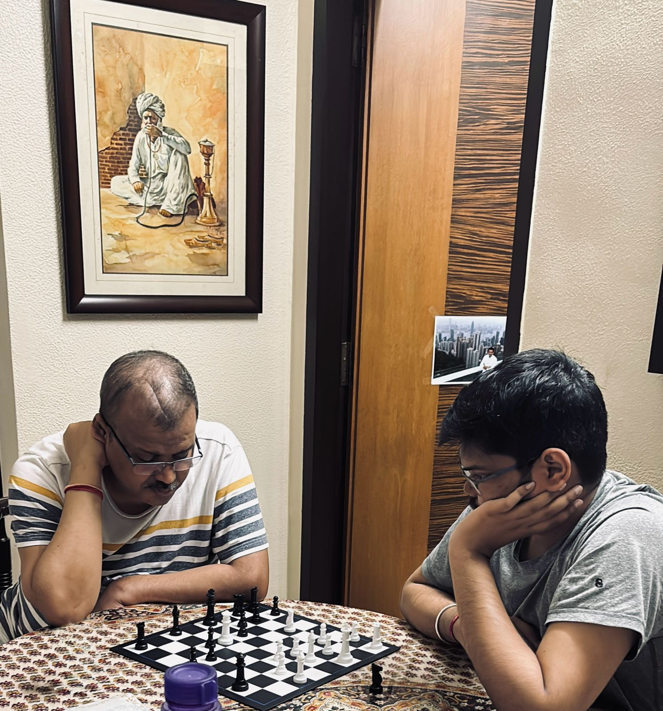

> TW: Medical Diagnosis, Illness

Until July of last year, my knowledge of brain tumors was limited to Dr. Derek Shepherd in Grey's Anatomy. It was from him I learnt the terms craniotomy/awake brain surgery, brain tumor, precision oncology and more.

> Today, 8th June is World Brain Tumor Day. It also marks 11 months since my father's brain tumor diagnosis.

Brain tumors come in various types and can be malignant or benign. Unfortunately, we found ourselves among the few thousand people in the world facing the ugliest type of brain tumor, [Glioblastoma](https://braintumor.org/events/glioblastoma-awareness-day/about-glioblastoma/).

For the uninitiated, glioblastoma is the most complex, treatment-resistant, and deadliest type of brain cancer. It's quite simple: a couple of cells in your body decide to turn rogue one day and combine into a tumor. In the case of GBM, this tumor is in your brain.

This marks almost one whole year of helping my father fight this horrific disease: 2 brain surgeries in a span of 8 months, radiation, chemotherapy, immunotherapy, and the overwhelming side effects.

Medication aside, the emotional battle is harder. To see someone who was once running a multi-billion dollar business as a CXO, now fighting for his life, is a different kind of challenge.

It's been a year of hearing "he doesn't have days left," and spending countless days and nights in hospitals, ambulances, and emergency rooms.

They say fighting cancer takes everything from you—it truly does, and it leaves you with a ton of trauma. Both the patient and the caregivers witness this firsthand. Fighting this disease feels like trying to hold onto grains of sand as they slip through your fingers.

You never know how many grains are left or which one will be the last.

> Cancer is an expansionist disease; it invades through bodies, through space, and even through time.

But my father is a fighter. He has fought till this minute and will continue fighting. He maintains his spirits, runs his office, and is funnier than ever, not letting this disease affect him one bit.

> As Paul Kalanithi wrote in "When Breath Becomes Air," "You can't ever reach perfection, but you can believe in an asymptote toward which you are ceaselessly striving."

When doctors share scary and daunting prognoses, I have realised that hope and faith play a significant role in this battle. Each diagnosis is unique and there are some favourable factors, some unfavourable factors that come together.

Statistics can be daunting, showing that only x% of people survive, but it's all about perspective.

You can either think you're in the 100-x%, or you can believe that you are part of the x% who make it through. In this fight, stats don't define your journey; hope does.

> There is some light at the end of the tunnel. It's not bright, and it's definitely not in my face, but I can still see the shimmers. And it's these shimmers that will keep us going strong. ✨

---

## Update: June 2025

My father passed away on 16th June 2025, after battling this horrific disease for 23 months—surrounded by my mother, my brother, and me. We truly gave it our all. Unfortunately, God had other plans. The shimmers I wrote about? They kept us going for twenty-three months. But sometimes, even the brightest hope can't outrun the darkest disease.

He left behind an incredible legacy in Indian consumer retail. In the days after his passing, colleagues and friends wrote about what he meant to them 

- [Damodar Mall](https://www.linkedin.com/posts/damodarmall_building-business-relationships-that-become-ugcPost-7340385333101875200-mRwy/)
- [Neil George](https://www.linkedin.com/posts/neil-george-b7698510_reliance-condolences-friend-activity-7340322945237508096-CKRa)
- [Manu Bansal](https://www.linkedin.com/posts/manu-bansal-9a517a14_think-mega-think-big-take-sundown-approach-activity-7340672441951662081-K-W1)
- [Aman Gupta](https://www.linkedin.com/posts/aman-gupta-4126a6135_om-shanti-i-am-deeply-saddened-to-hear-about-activity-7340337222480556032-wHqA)
- [Satish N Thaker](https://www.linkedin.com/posts/satish-n-thaker-45b4b3141_om-shanti-i-am-deeply-saddened-to-hear-about-activity-7340297408846753792-FuLF)
- [Aditya Sameer Kaji](https://www.linkedin.com/posts/aditya-sameer-kaji-7712b614_remembering-mr-prrasana-shah-we-lost-a-activity-7341333969449148417-74H5)
- [Anusha Jain Gupta](https://www.linkedin.com/posts/anusha-jain-gupta-80168a146_remembering-prrasana-shah-it-was-an-absolute-activity-7341853530904764416-Su8E)
- [Sajit Nair](https://www.linkedin.com/posts/sajit-nair-576b3083_remembering-a-remarkable-leader-prasanna-activity-7340565501418295296-LxnQ)
- [Sohel Khwaja](https://www.linkedin.com/posts/sohel-khwaja-017a968_deeply-saddened-by-the-passing-of-mr-prrasana-activity-7340669638361473025-eZpH)
- [Sushil Mishra](https://www.linkedin.com/posts/sushil-mishra-48334067_still-in-shock-after-hearing-the-sad-news-activity-7340632540275273729-P-A-)
- [Bipin K](https://www.linkedin.com/posts/bipin-k-b07112b0_you-are-truly-a-wonderful-mentor-and-a-remarkable-activity-7340474711119753216-kZq8)
- [Tribute](https://www.linkedin.com/posts/activity-7340610807061168129-_1hg)
