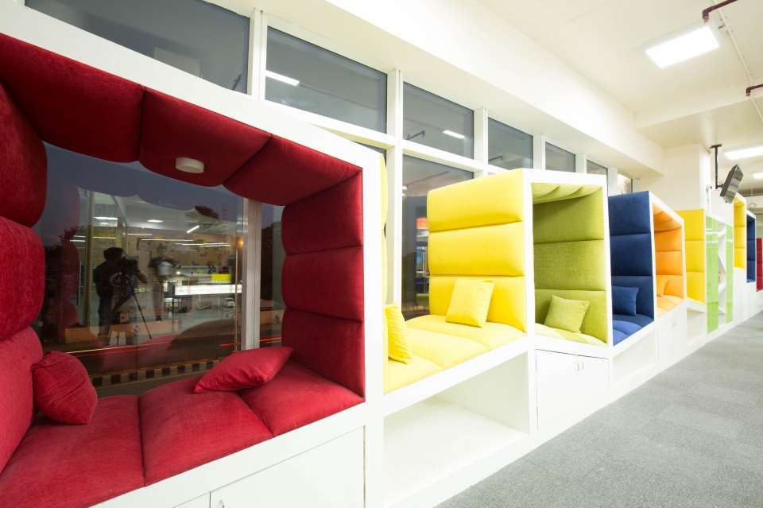
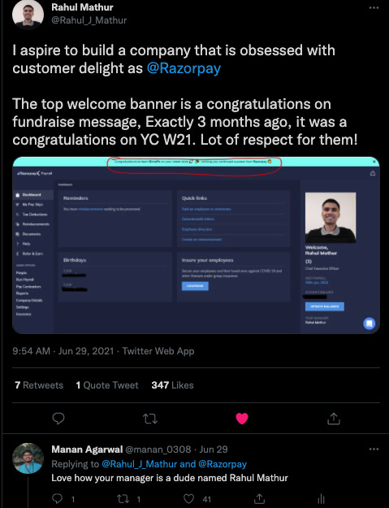
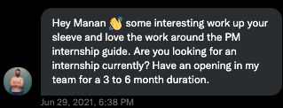

> **Disclaimer:**  This experience has survivorship bias; no two people reading this have the same story. No two people reading this will have the same journey. This is just an account of how my experience was and in **no way reflects the viewpoints of Razorpay as a company or its employees**.

Now that the disclaimer is out of the way, here’s who I am:

> I am Manan Agarwal, a final year engineering undergrad at MIT, Manipal, and I work as a product management intern at Razorpay. More specifically, I work in the RazorpayX Payroll team, where I own a bunch of initiatives around Group Medical Insurance and the Payroll product.

How I landed here is a story worth telling. Recently, it has also been the most asked question to me.

While this may seem like a story of getting extremely lucky and can be a case study in serendipity, I’d want to say it has been a long journey of 3+ years of hustling in the ecosystem that has resulted in this. 

Although this is just the start, and the hustle never really stops, it is a good point to stand and reflect on the journey till here.

> *“Luck is manufactured only when opportunity meets preparation”*

If I were you, an aspiring PM Intern or just a general college student reading this, the **only** takeaway from this is to keep doing what you’re doing and trust the process. 
Good things and opportunities will come your way, if not immediately, eventually. Your career is 30-40 years long. Two internships more or less barely scratch the surface.

In late 2019, I used to work at SpringWorks and had moved to Bangalore for my internship. Almost every weekend, I used to cross the Hosur main road and would look at people sitting next to the windows working, overlooking the road. Coincidentally I would always say this looks like such a cool place to work, mainly because these couches are all you saw from the road :

Cut to 2021, have done two internships one as a PM at Bounce, talk about it [here](https://www.mananagarwal.in/pm-internship-at-bounce-learnings-and-the-experience), the one at Springworks, built and scaled InternFinder and almost graduated college. 

I came across this from Rahul Mathur at BimaPe and just replied in jest:

[Aditya Morarka](https://twitter.com/AdityaMorarka) {Follow him so I can ask for a raise :P} , who is the PM at RazorpayX Payroll saw this tweet and while replying to Rahul chanced upon my tweet and sent this :

If you’ve been in the Indian ecosystem long enough, you’d know, Razorpay doesn’t have an internship program for PM Interns and only hires them based on business needs. This was when I thought, this is the perfect opportunity to grab it.

Following this, there were 4 rounds :

**Disclaimer**: This is **NOT** standard practice Razorpay wide. It was a very specific process created for this role :
The normal PM hiring process at Razorpay is defined [here.](https://razorpay.com/unfiltered/how-we-hire-product-managers-and-what-to-expect-in-your-pm-interviews-at-razorpay/) 

## Round 1 - Intro Round :

I was asked about previous experiences, specifically on InternFinder from a product thinking PoV about its conceptualisation, GTM, and what’s next.

I had done a fair bit of research on the product, including watching a 1.5-hour webinar on YouTube about it, so that worked because I believe I asked reasonably good questions.

## Round 2 - Assignment Round :

Received an interesting problem to write a Concept Note (read more about Concept Note and how it’s different from traditional PRDs) [here](https://razorpay.com/unfiltered/how-razorpay-is-building-great-products-by-avoiding-traditional-prd-approach/#:~:text=A%20concept%20note%20is%20supposed,plan%20or%20a%20VC%20pitch.)

Take any B2B product and build a feature that adds a large amount of value to its customer.

This is challenging in two ways : 
1. B2B product exposure is significantly less at this stage of my career.
2. Building a feature on top of this that will add a large amount of value is also more challenging.

I wrote a detailed and extensive Concept Note as my solution which I may make public in the future.

## Round 3 - Assignment Discussion + Product Thinking Round :

Interesting round: I was asked to present my Concept Note and was asked questions on how I thought about metrics, GTM, and a bunch of contextual stuff. 

There was also an interesting B2B  live product problem where I had to think from conceptualization to the GTM of the problem statement.

Ended up having a 2-hour chat with Aditya, never felt like an interview.

## Round 4 - Stakeholder Round :

Extremely fun chat with Anuj Jain, who is the founder of Opfin (now XPayroll) and a GM and Director at XPayroll, where I spoke about my journey of what all I have done to date with a couple of questions from him on some projects.

This entire process lasted for a month and culminated with me signing the offer letter on my birthday, so it was a happy ending.

[DMs on Twitter](https://twitter.com/manan_0308) always open to chat. Thanks for reading, folks :)

If you want to read more on cracking PM Internships I wrote a bit about it [here.](https://www.mananagarwal.in/cracking-the-product-management-internship)
