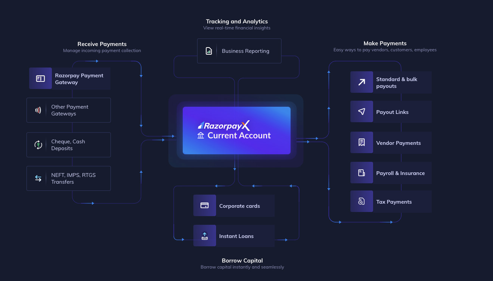
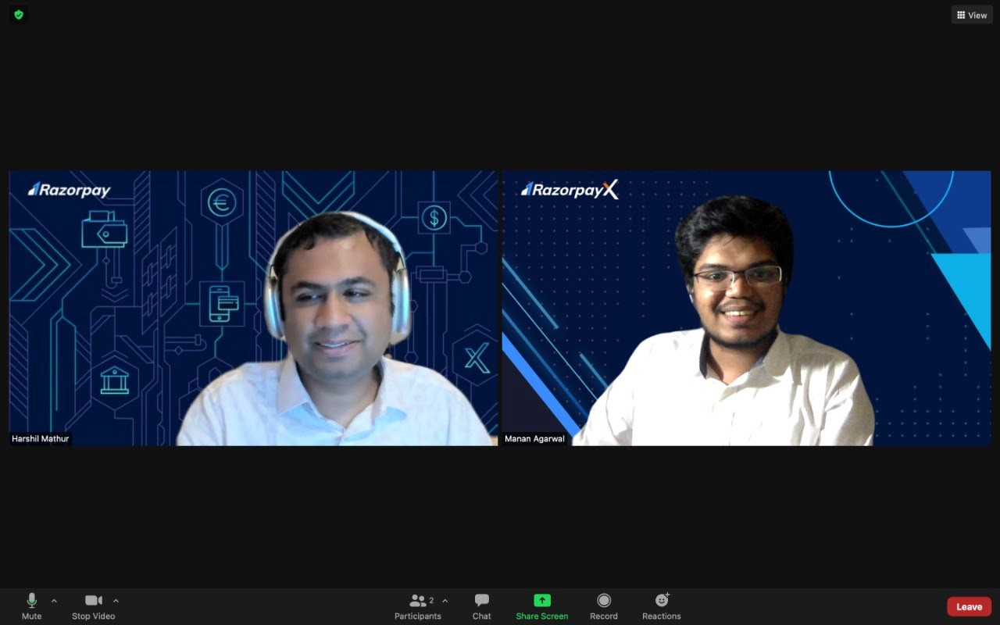
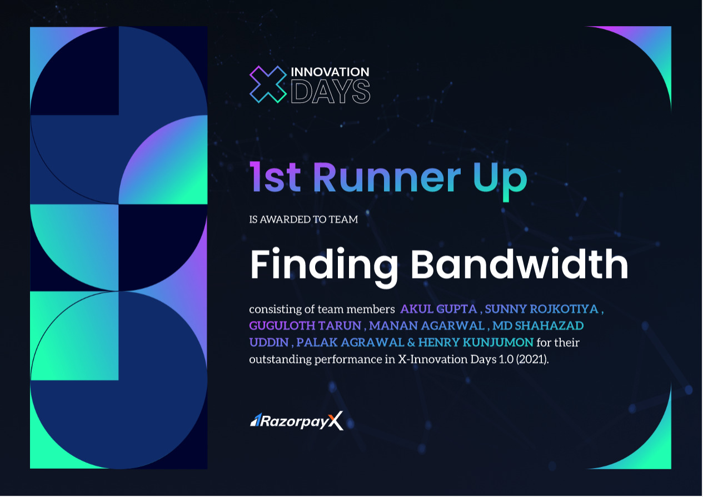

> Wrapping up a 3 month Product Management Internship at Razorpay

## The prologue:

I just wrapped a three-month-long Product Management(PM) internship at Razorpay. 

Writing on the internet is how [I landed here](https://www.mananagarwal.in/landing-at-razorpay), and It would only be apt to conclude the internship by writing about it.

I worked in the RazorpayX Payroll product team - a product that the industry swears by(check out our [wall of love](https://razorpay.com/payroll/wall-of-love/)). The experience was excellent, at the least.

## The experience:

I did many things over the past three months, and if I begin to list them down sequentially, you ought to get bored and close this.

So I’ll try to break it down into a couple of cohorts primarily: the work and the culture.

## The work:

What makes solving a problem worthwhile is the degree of its complexity and the magnitude of the pain it causes to someone. Payroll ticks both these boxes for its user.

Payroll is a necessary product. It’s the one thing that any founder needs the moment they start a company. Payroll is also a complex, highly complex thing. Trust me, the number of complicated support tickets I have heard over the past three months is mind-boggling.

This is the problem RazorpayX Payroll is solving for over 2000+ organizations ranging from a seed-stage to a series H company.

One of my earliest takeaways, after I started here, was the financial ecosystem Razorpay is creating for business owners in India. I’d always read about it like the rest of us, but to see it live how RazorpayX is going to be the future of business banking was magical.

As a PM Intern, the core of my job involved end-to-end ideation to execution of certain critical product features. However, I also did a bunch of various other things.

Running product - growth experiments on the Insurance module in the product, coming 2nd in the annual internal hackathon with my team, working on a partnership with a leading fintech, and a LOT of ad-hoc tasks.

It is rightly said that PMs do the job that no one else does, which sometimes is copy editing that post that displays in the product every time a user logs in.

## The culture:

This picture is my sole submission for the unique culture at Razorpay:

Razorpay is a large organization(2000+ employees and growing). I, as an intern, can still get 30 minutes to talk to Harshil, who is the co-founder and CEO on Zoom. As a college kid in the ecosystem, I don’t think an internship can offer more than this.

> Razorpay’s leadership culture is a case study on its own. All senior leaders have open Calendly links to schedule 1:1s with them for 30-45 mins and ask them anything. 

I spoke to 7 Directors and above-level leaders in Product Management and Design on a career in PMing and many other things. These are interactions that only a culture like this can enable, especially at the scale at which the company currently operates.

The product culture in Razorpay is also very unique. Every week there are product demo hours in RazorpayX where whatever is being shipped out by any of the pods in X is presented to a large forum. This enables the people building to get feedback from a wider audience and allows you to know what is happening in other pods outside your day-to-day work.

[Anuj Jain](https://www.linkedin.com/in/anujjain1981) has built the XPayroll team and the Opfin (now XPayroll) product from the ground up. The team comprises highly talented people building an insanely good SaaS product, and it reflects in the kind of passion everyone brings to the table.

> **As an intern, you need a healthy combination of mentorship + ownership. You should have the flexibility to go figure things out independently and when you hit roadblocks you come back and seek guidance**

[Aditya Morarka](https://twitter.com/AdityaMorarka) did precisely that. Inside RazorpayX Payroll, I was a full-time PM.

Everyone on the team treated me as a full-time employee hired for his abilities and not a college kid. From the kind of work I was given to the things I did, the expectations were of someone working full-time, and hopefully, I lived upto them :P. An exciting event that took place was X Innovation Days: RazorpayX’s annual hackathon.

A week of stopping everything else and working on creating something new from scratch that is production-ready. My team stood 2nd in this and won a cash prize of 45K, but the thrill of creating something new from scratch so fast was the biggest high, obviously after the one coffee gave from the sleepless nights.

Any mention of culture at Razorpay is illegal without talking about the Bakar threads during the monthly town halls. This company truly is [meme-first.](https://twitter.com/shashankmehta05/status/1418545951858315272?s=20)

## The epilogue:

Razorpay is a fantastic company to work at, and I couldn’t be more thrilled to start my career here. I am incredibly grateful to Aditya, Anuj, and Shashank Mehta for giving me this opportunity. Special shoutout to Rohit, Yadhu, Ullas, Abhishek, Henry, Ashish, Palak, Tarun, Sunny, Akul, Nick, and Shahazad for being such awesome people to work with.

If you want to talk to me about anything under the sun, drop me [a DM on Twitter](https://twitter.com/manan_0308)

